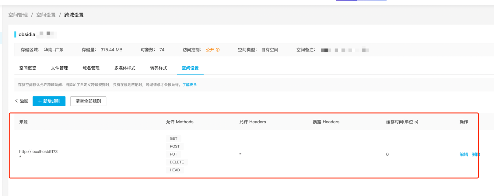
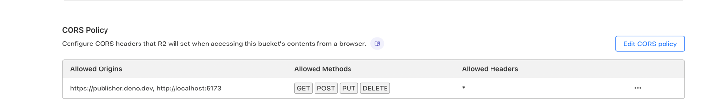

# Obsidian Publisher

配合 [Obsidian Publish Host](https://github.com/jooooock/obsidian-publish-host) 进行使用的发布工具。

## 支持的存储

- 七牛云
- Cloudflare R2
- 其他兼容 AWS S3 的存储服务

## 如何使用？

### 第一步：选择需要发布的 Obsidian 仓库根目录

浏览器访问 https://publisher.deno.dev, 选择打开指定的 Obsidian 仓库目录

> [!NOTE]
> 该网站程序利用了浏览器的 [File and Directory Entries API](https://developer.mozilla.org/en-US/docs/Web/API/File_and_Directory_Entries_API)，所以需要明确授权该网站访问指定的目录权限。
> 
> 比如，出现下面这样的弹窗时，请选择同意：
> 
> 

打开之后的界面显示如下：

### 第二步：配置存储服务

通过顶部的【存储配置】按钮打开【存储配置弹框】，如下：

将对应字段填入并保存。

### 第三步：选择文件并发布

### 第四步：配置网站

通过顶部的【网站配置】按钮打开【网站配置弹框】，如下：

修改相关字段并保存。

## FAQ

### 1. 利用该程序上传时需要对存储空间进行跨域的设置

七牛云的设置如下:

Cloudflare R2 的设置如下:

> http://localhost:5173 是方便本地调试，纯线上不需要配这个域。

### 2. 如果有使用上或者配置上的任何问题，欢迎在 Issue 区讨论

## License

MIT
