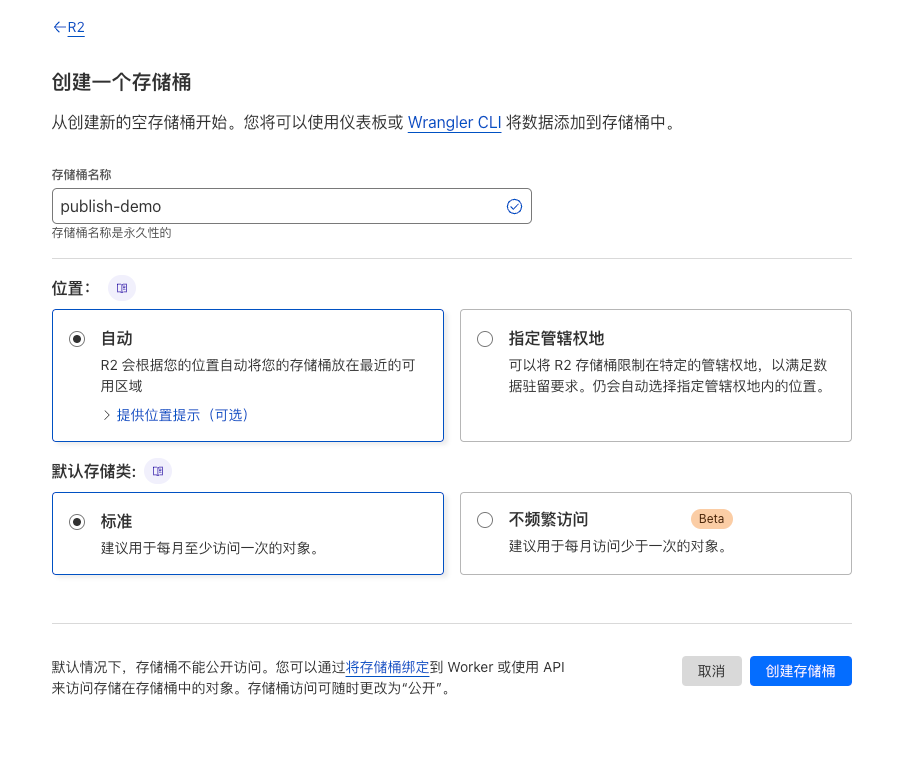

# Obsidian Publisher

配合 [Obsidian Publish Host](https://github.com/jooooock/obsidian-publish-host) 进行使用的发布工具。

## 支持的存储

- 七牛云
- Cloudflare R2
- 其他兼容 AWS S3 的存储服务

## 如何使用？

### 第一步: 准备云存储空间

可以申请免费的云存储空间，这里以七牛云和 Cloudflare R2 为例来演示：

#### 1. 七牛云空间的创建

创建一个七牛云空间，访问控制选择【私有】，如下所示:

然后在空间设置里新增跨域规则，如下所示:

`Access Key`和`Secret Key`可通过密钥管理处获取:

#### 2. Cloudflare R2 存储桶的创建

创建一个 R2 存储桶，如下所示:

然后在桶的设置中新增 CORS 策略，如下所示:

`Access Key`和`Secret Key`可通过管理 R2 API 令牌来创建:

### 第二步: 选择需要发布的 Obsidian 仓库根目录

浏览器访问 https://publisher.deno.dev, 选择打开指定的 Obsidian 仓库目录

> [!NOTE]
> 该网站程序利用了浏览器的 [File and Directory Entries API](https://developer.mozilla.org/en-US/docs/Web/API/File_and_Directory_Entries_API)，所以需要明确授权该网站访问指定的目录权限。
> 
> 比如，出现下面这样的弹窗时，请选择同意：
> 
> 

打开之后的界面显示如下：

### 第三步: 配置存储空间

通过顶部的【存储配置】按钮打开【存储配置弹框】，如下：

将第一步创建的空间对应字段填入并保存。

### 第四步: 选择文件并发布

### 第五步: 配置网站

通过顶部的【网站配置】按钮打开【网站配置弹框】，如下：

修改相关字段并保存。

## License

MIT
